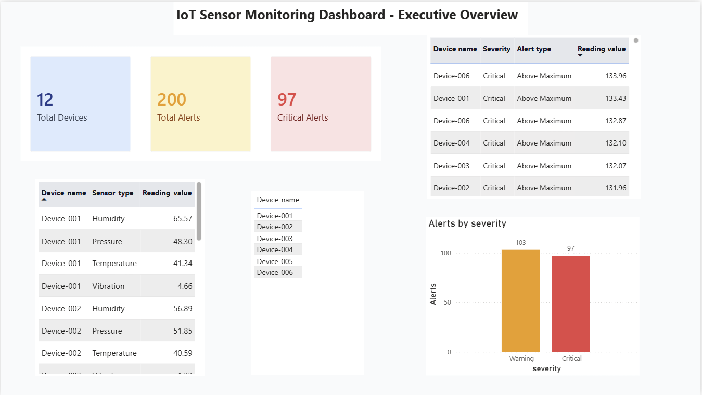
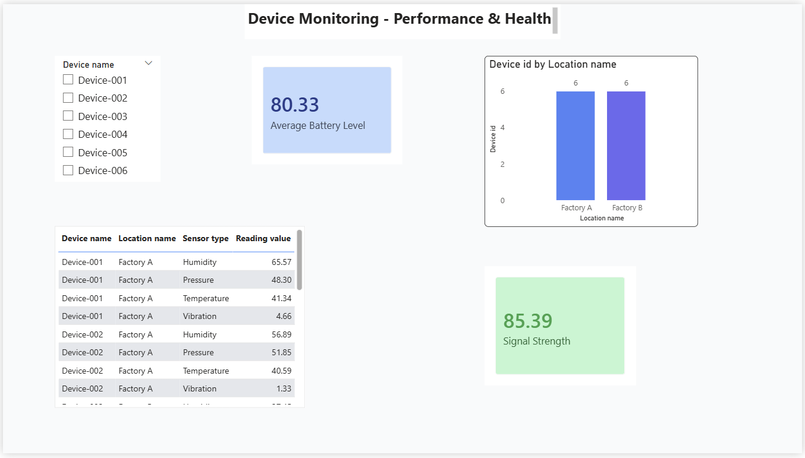
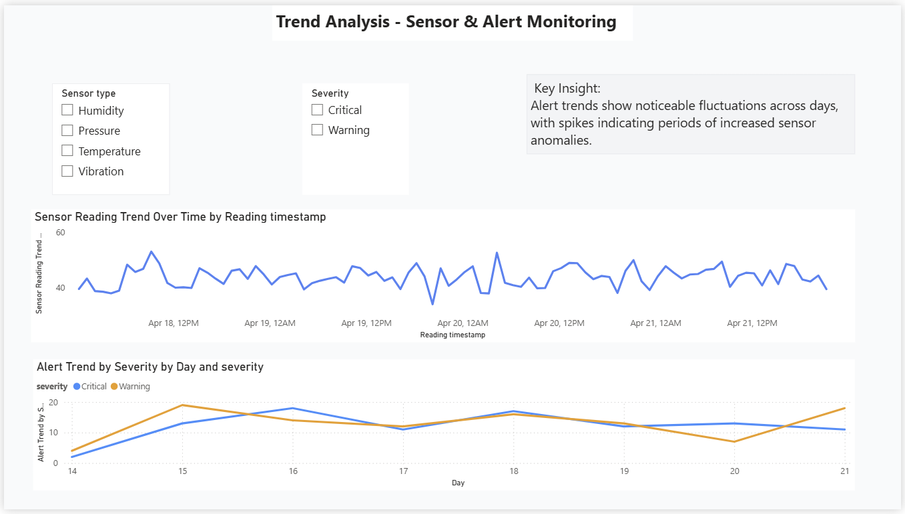
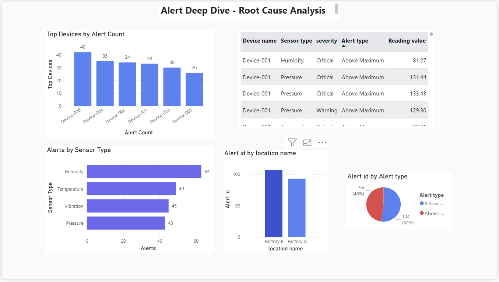

# 📡 IoT Sensor Monitoring Dashboard
> A full-stack data analytics portfolio project by **Venkata Sai Krishna Baggu**


---

## 📌 Project Overview

This project delivers a complete, end-to-end IoT data analytics pipeline —
built to simulate how real industrial environments monitor connected sensor devices.
Sensor readings including temperature, humidity, vibration, and pressure are
generated using Python, stored in a PostgreSQL database, transformed using SQL,
and visualised through a professional multi-page Power BI dashboard.

Built independently as a **personal portfolio project**, this solution demonstrates
hands-on skills across the full data stack — from data generation and database
design, through SQL querying and views, to interactive Power BI reporting.

---

## 🛠️ Tools & Technologies

| Tool | Purpose |
|------|---------|
| Python (Pandas · NumPy · Faker) | Synthetic sensor data generation |
| PostgreSQL | Relational database storage & management |
| pgAdmin | Database setup, SQL execution & CSV import |
| SQL (DDL · DML · Views) | Data modelling, transformation & alert logic |
| Power BI Desktop | Interactive dashboard & visual reporting |
| GitHub | Version control & portfolio showcase |

---

## 🔄 Data Pipeline Architecture

```
[ Python Scripts ]
        ↓
  Generate synthetic sensor data
  (temperature, humidity, vibration, pressure)
        ↓
[ pgAdmin — PostgreSQL ]
  Create database schema
  Import CSV data into tables
        ↓
[ SQL — Views & Queries ]
  Transform data
  Apply threshold alerting logic
        ↓
[ Power BI Dashboard ]
  Connect to PostgreSQL
  Visualise insights & enable drill-through analysis
```

---

## 🧱 Data Model — Star Schema

```
                  ┌─────────────┐
                  │   Device    │
                  └──────┬──────┘
                         │
┌──────────┐    ┌────────┴────────┐    ┌──────────┐
│  Sensor  ├────│ Sensor Readings ├────│ Location │
└──────────┘    │   (Fact Table)  │    └──────────┘
                └────────┬────────┘
                         │
                  ┌──────┴──────┐
                  │   Alerts    │
                  └─────────────┘
```

- **Fact Table** — Sensor Readings (reading value, timestamp, device ID)
- **Dim: Device** — device name, type, status, battery level, signal strength
- **Dim: Sensor** — sensor type, unit, min/max thresholds
- **Dim: Location** — facility, zone, geographical coordinates
- **Dim: Alerts** — alert type, severity (Critical / High / Medium / Low), status

---

## 📊 Dashboard Pages

### 1. 🏢 Executive Overview
- KPI scorecards — total devices, total alerts, critical alert count
- Alert distribution by severity (Critical / High / Medium / Low)
- Latest sensor readings snapshot across all active devices

### 2. 🖥️ Device Health Monitoring
- Device-level performance grid (status, uptime, battery, signal strength)
- Battery and signal strength health indicators
- Device distribution by facility location

### 3. 📈 Trend & Anomaly Analysis
- Time-series sensor reading charts with rolling averages
- Alert frequency trends segmented by severity over time
- Anomaly detection based on deviation from device baseline

### 4. 🔍 Alert Deep Dive
- Ranked list of top alert-generating devices
- Alert distribution by sensor type and facility location
- Drill-through detail table for root cause investigation

---

## 📸 Dashboard Preview

### Executive Overview


### Device Health Monitoring


### Trend & Anomaly Analysis


### Alert Deep Dive


---

## 🔍 Key Insights

- **Device-006** consistently generates the highest alert volume —
  indicating probable hardware degradation or miscalibration
- **Humidity sensors** account for the greatest share of alerts
  across all sensor types
- Alert frequency shows **cyclical day-to-day patterns**,
  suggesting operational or environmental cycles
- Certain **facility locations** show significantly higher alert
  concentrations, warranting targeted site-level review

---

## 🚀 How to Run

**1. Clone the repository**
```bash
git clone https://github.com/bvskrishna3137/IoT-Sensor-Monitoring-Dashboard.git
cd IoT-Sensor-Monitoring-Dashboard
```

**2. Install Python dependencies**
```bash
pip install -r requirements.txt
```

**3. Generate the sensor data**
```bash
python src/generate_sensor_data.py
python src/generate_alerts.py
```

**4. Set up PostgreSQL Database**
- Open **pgAdmin**
- Create a new database called `iot_dashboard`
- Open **Query Tool** and run `sql/views.sql`
- This will create all tables — Device, Sensor, Location, Alerts, Sensor Readings

**5. Import CSV data into PostgreSQL**
- In pgAdmin right click your table
- Select **Import/Export Data**
- Choose `data/raw/sensor_readings.csv`
- Click **OK** to import

**6. Run SQL Views and Queries**
- Open **Query Tool** in pgAdmin
- Run `sql/views.sql` to create reporting views
- Run `sql/analysis_queries.sql` to apply alert logic and analysis

**7. Connect Power BI to PostgreSQL**
- Open `power bi/IoT_Sensor_Dashboard.pbix`
- Go to **Home** → **Transform Data** → **Data Source Settings**
- Set your PostgreSQL server and database name `iot_dashboard`
- Click **Refresh** to load latest data

**8. Explore the Dashboard**
- Page 1 → Executive Overview
- Page 2 → Device Health Monitoring
- Page 3 → Trend & Anomaly Analysis
- Page 4 → Alert Deep Dive

---

## 📁 Project Structure

```
IoT-Sensor-Monitoring-Dashboard/
│
├── README.md
├── requirements.txt
│
├── data/
│   ├── processed/
│   └── raw/
│       └── sensor_readings.csv
│
├── docs/
│   └── IoT Sensor Monitoring Dashboard for Smart Factory Equipment.docx
│
├── power bi/
│   └── IoT_Sensor_Dashboard.pbix
│
├── screenshots/
│   ├── page1_overview.png
│   ├── page2_device.png
│   ├── page3_trend.png
│   └── page4_alert.png
│
├── sql/
│   ├── views.sql
│   └── analysis_queries.sql
│
└── src/
    ├── generate_sensor_data.py
    ├── generate_alerts.py
    └── load_to_postgres.py
```

---

## 📄 Project Report

[](docs/IoT%20Sensor%20Monitoring%20Dashboard%20for%20Smart%20Factory%20Equipment.docx)

> Full technical report covering project architecture, data model,
> dashboard design, key insights, and future roadmap.

---

## 🔮 Future Enhancements

- [ ] Real-time streaming with Apache Kafka or Azure Event Hubs
- [ ] Predictive maintenance using Machine Learning (LSTM / Isolation Forest)
- [ ] Automated alert notifications via Email / SMS / Microsoft Teams
- [ ] Cloud deployment on Microsoft Azure (ADF + Azure PostgreSQL + Power BI Premium)

---

## 👤 Author

**Venkata Sai Krishna Baggu**
Data Engineer & Analytics Developer

[](https://github.com/bvskrishna3137)
[](mailto:bvskrishna3137@gmail.com)

---

## 📄 License

This project is developed for **personal portfolio and non-commercial use only**.